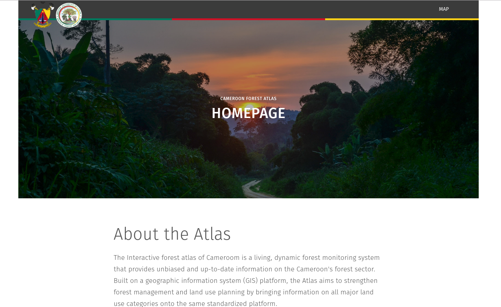

# Forest Atlas and Landscape Application CMS




Multisite content management system for Forest Atlas and Landscape Applications

## CI status

[](https://travis-ci.org/Vizzuality/forest-atlas-landscape-cms)

## Dependencies

Ruby 2.3.1
nodejs + npm


## Installation

### Without Docker

Install global dependencies:

    gem install bundler

Install project dependencies:

    bundle install
    npm install

Set up environment variables by copying `.env.sample` to `.env` and filling up the necessary values accordingly

To set up the database, run:

    bundle exec rake db:create
    bundle exec rake db:migrate
    bundle exec rake db:seed

If you're running a previous version of the application site settings, run:
```
bundle exec rake db:site_settings:update
```

If you are on a development environment, you might also want to load some sample data:

    bundle exec rake db:sample

While not required, it's highly recommended that you use the included git hooks. 

    ./bin/git/init-hooks
    
You only have to do this once. Future changes to hooks will be loaded automatically.

### With Docker

#### First time user

Perform the following steps:
* [Install docker](https://docs.docker.com/engine/installation/)
* Clone this repository: ```git@github.com:Vizzuality/forest-atlas-landscape-cms.git```
* Enter in the directory (cd forest-atlas-landscape-cms)

Set up environment variables by copying `.env.sample` to `.env` and filling up the necessary values accordingly


## Running

### Without Docker

To run application:

    bundle exec rails server
    
### With Docker

you open a terminal (if you have mac or windows, open a terminal with the 'Docker Quickstart Terminal') and execute the next command:

```bash
    ./service.sh develop

```

#### First time running the app with Docker
To set up the database, run:

    docker-compose -f docker-compose.dev.yml run web rake db:seed

If you are on a development environment, you might also want to load some sample data:

    docker-compose -f docker-compose.dev.yml run web rake db:sample
    
## Development

### Code Quality

To keep a good and consistent quality code we use `eslint` (JS) and `sass-lint` (CSS).

`eslint` rules are based on [Airbnb](http://airbnb.io/javascript/) ones.

`sass-lint` rules are based on [SMACSS](https://github.com/brigade/scss-lint/blob/master/data/property-sort-orders/smacss.txt) ones.

Also we have some custom rules you can check in `.eslintrc` and `.sass-lint`, respectively.

Have fun coding! 😁🌲


## Deployment

We use [Capistrano](http://capistranorb.com/) as a deploy tool. To deploy to production, simply run:

    cap production deploy
    
What needs doing as well is:
`RAILS_ENV=production bundle exec rake site:create_assets`

## Server Setup

### Cronjob

Add a cronjob to delete the old sessions from the database.
This can be accomplish by setting the cronjob like this:

    0 5 * * * cd /path/to/app/dir/ && rake RAILS_ENV=production sessions:trim > /dev/null 2>&1

This will run at 5 AM every day and delete the old sessions.

### Environment variables description

#### API_URL

URL of the API gateway. Used for user authentication.

#### GLOBAL_GA_KEY

Key for Google Analytics. Used on all sites. For site-specific GA integration, use the admin interface.
